# Reading Analysis

Analysis of personal Goodreads reading history — cadence, diversity, page counts, publication age, format trends, and more.

Originally started in late 2019 ([write-up here](https://notionparallax.co.uk/2019/goodreads2019)). Extended in 2020 by [Clare Oh](https://github.com/Claire-Oh) to include LGBTQI+ representation analysis. Modernised in 2026 to remove the defunct Goodreads API and replace it with a CSV-export-based workflow.

---

## Quick start

### 1. Install dependencies

```bash
pip install -r requirements.txt
```

### 2. Export your Goodreads library

In Goodreads: **My Books → Import and Export → Export Library**

Save the downloaded file as `goodreads_library_export.csv` in this folder.

### 3. Run ingestion

```bash
python ingest.py
```

This reads the export, normalises columns, recovers any `started_at` dates from legacy API data, and writes:

- `books_annotated.csv` — your reading data, ready for annotation (stays in this repo)
- `C:\Users\...\OneDrive - BVN\book_analysis\authors.xlsx` — blank author demographics template (lives in OneDrive)

### 4. Fill in annotations

Open `books_annotated.csv` and fill in these columns for each book:

| Column | Values |
|--------|--------|
| `ficOrNonFic` | `Fiction` / `NonFiction` |
| `SeriesOrStandalone` | `Series` / `Standalone` |
| `LGBTQIA_Characters` | `Yes` / `No` |
| `started_at` | date you started reading (ISO format: `2024-03-15`) |

> Tip: run `python annotate_books.py` first — it auto-fills ~97% of books based on a built-in knowledge base, so you only need to check/correct rather than fill from scratch.

### 5. Fill in author demographics

Open `authors.xlsx` (in OneDrive) and fill in columns for each author:

| Column | Example values |
|--------|----------------|
| `gender` | `Male` / `Female` |
| `ethnicity` | `White` / `Asian` / `Black` / `Hispanic` / `Indigenous` |
| `LGBTQI_Authors` | `Straight` / `Gay` / `Lesbian` / `Bisexual` / `Unknown` |
| `Nationality` | `Australian` / `British` / etc. |
| `DeadorAlive` | `Alive` / `Dead` |

> Tip: run `python populate_authors.py` first — it pre-fills known authors automatically.

### 6. Generate charts

```bash
python analysis.py
```

Charts are written to `out/` as PNG files (plus a PDF for the waterfall chart).

---

## Re-running after new books

When you've finished more books, export a fresh `goodreads_library_export.csv` from Goodreads, then:

```bash
python ingest.py          # regenerates books_annotated.csv (preserves nothing — re-annotate)
python annotate_books.py  # auto-fills known books
python populate_authors.py  # adds any new authors
python analysis.py        # regenerates charts
```

> **Note:** `ingest.py` always writes a fresh `books_annotated.csv`. Your manual annotations in the old file are not carried over automatically. Fill in any new books and spot-check the auto-filled ones, then re-run `analysis.py`.

---

## File map

| File | Purpose |
|------|---------|
| `goodreads_library_export.csv` | Raw Goodreads export (your input) |
| `ingest.py` | Converts export → `books_annotated.csv` |
| `annotate_books.py` | Auto-fills `ficOrNonFic`, `SeriesOrStandalone`, `LGBTQIA_Characters` |
| `populate_authors.py` | Auto-fills `authors.xlsx` with known author demographics |
| `analysis.py` | Reads annotated data → generates all charts in `out/` |
| `books_annotated.csv` | Book data + manual annotations (edit this) |
| `authors.xlsx` *(OneDrive)* | Author demographics (edit this) |
| `requirements.txt` | Python dependencies |
| `archive/` | Old scripts and notebooks (kept for reference) |
| `out/` | Generated chart images |

---

## Config

At the top of `analysis.py`:

```python
READER_NAME  = "Ben"          # used as prefix on output filenames
BOOKS_FILE   = "books_annotated.csv"
AUTHORS_FILE = r"C:\...\authors.xlsx"
OUTPUT_DIR   = "out"
HISTORY_START = datetime.date(2014, 1, 1)   # earliest date on waterfall chart
```

---

## Charts generated

| Chart | Description |
|-------|-------------|
| `bookWaterfall_allTime` | Reading duration per book (also exported as PDF) |
| `booksPerMonth` / `booksPerYear` | Reading cadence |
| `publicationYearHist` | Publication year distribution (with 1900+ inset) |
| `publicationLag` / `publicationLagTrend` | How old books were when read |
| `numPages` | Page count distribution |
| `format` / `formatOverTime` | Format breakdown and shift over time |
| `publisher` | Top publishers (normalised) |
| `rating` / `ratingByYear` | Rating distribution and average by year |
| `prolificAuthors` | Authors read more than once |
| `ficNonfic` / `seriesStandalone` / `lgbtqiaCharacters` | Book annotation breakdowns |
| `uniqueAuthors_*` | Author demographics (gender, ethnicity, nationality, sexuality, compound) |
| `booksRead_gender` / `booksRead_ethnicity` | Books read by author demographic |
| `annualDiversity` / `annualGenderAlive` / `annualFicNonfic` | Annual stacked breakdowns |
| `diversityTrends` | % female / non-white / LGBTQIA+ authors as trend lines |
| `compoundDiversity_*` / `pages_*` | Cross-tab and pages-by-attribute charts |
| `ratingByDemographic` | Your mean rating by author gender, ethnicity, sexuality |


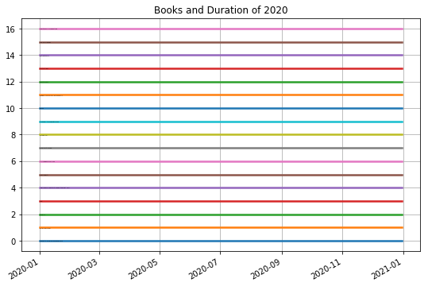

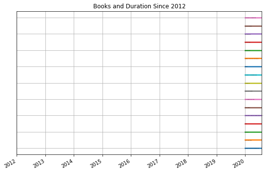

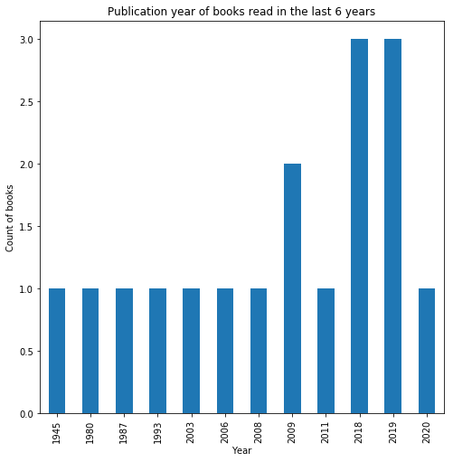


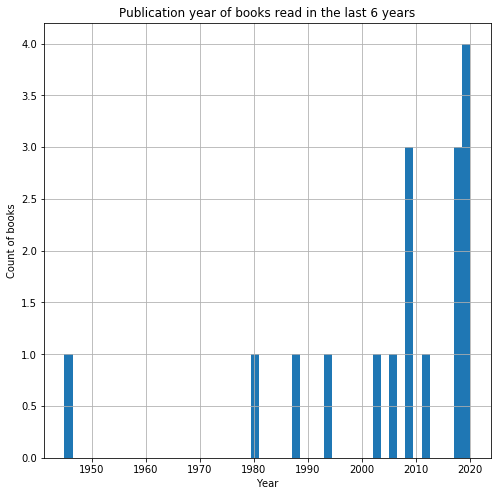

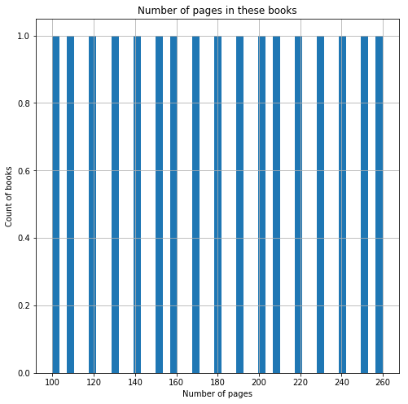

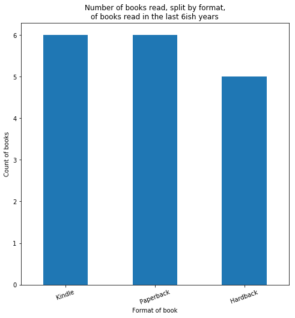

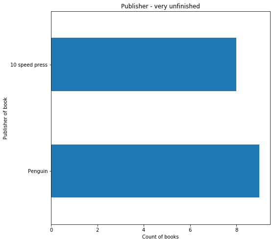

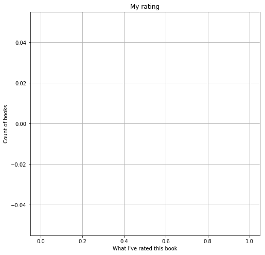

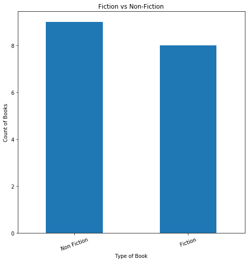

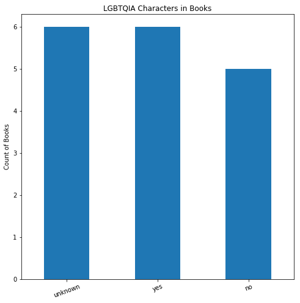


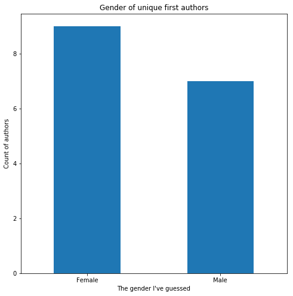

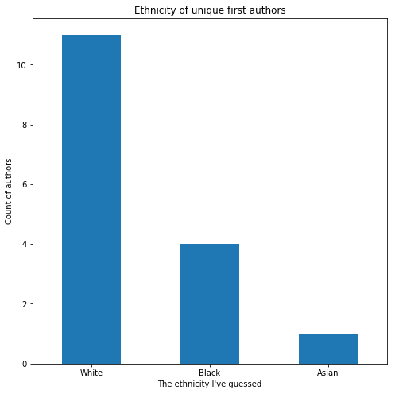

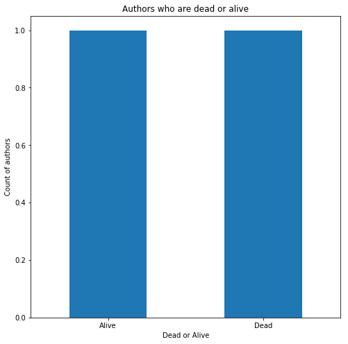

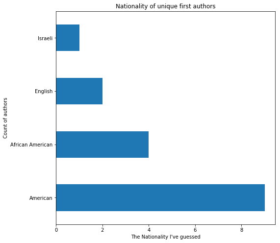

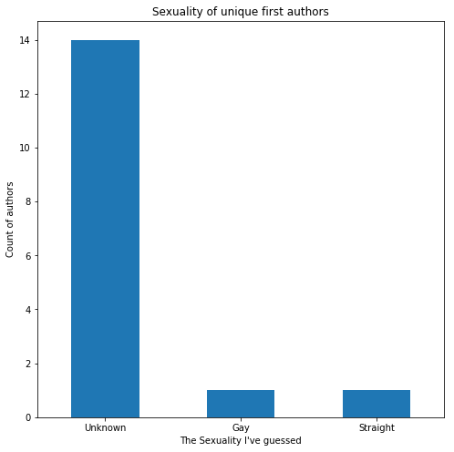

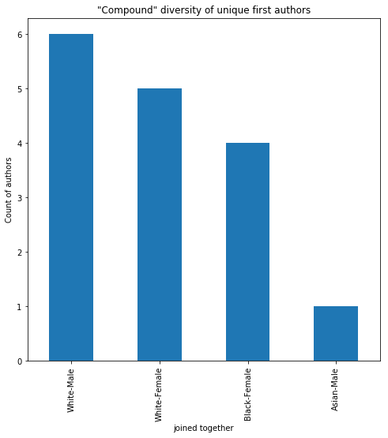

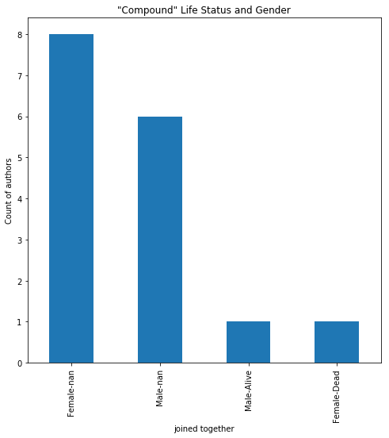


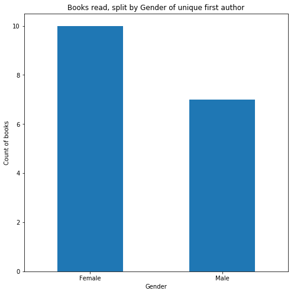

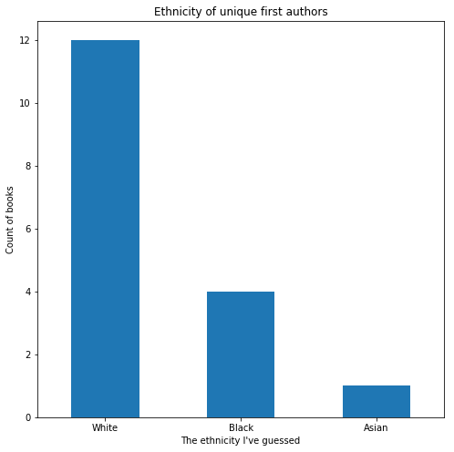

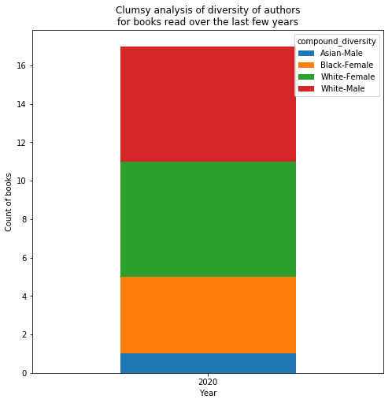

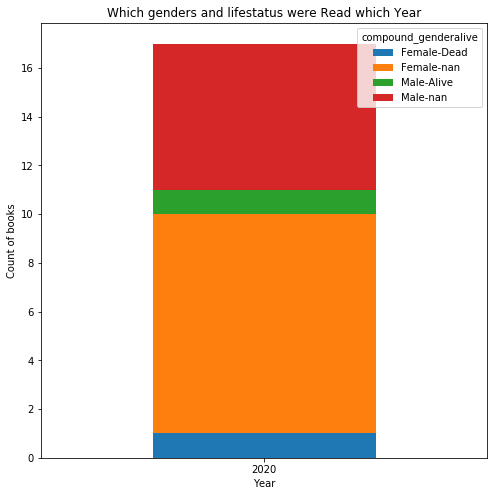


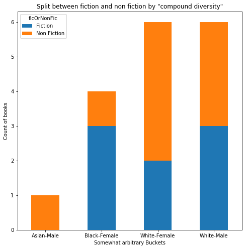


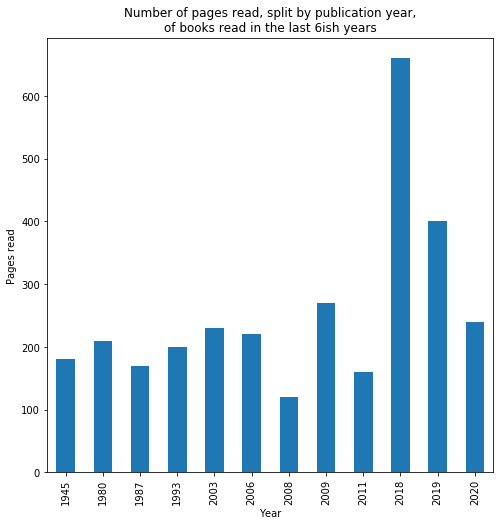

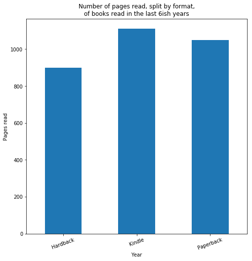

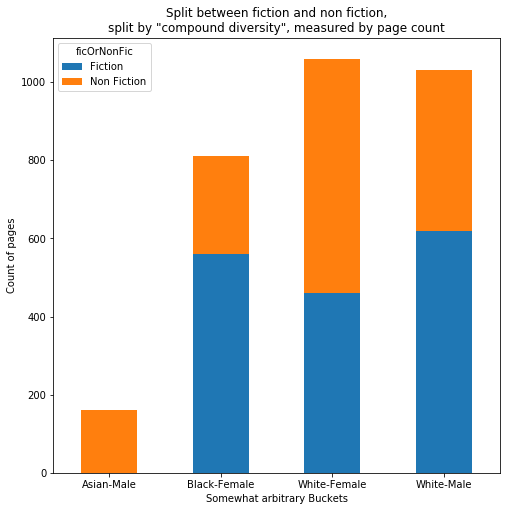

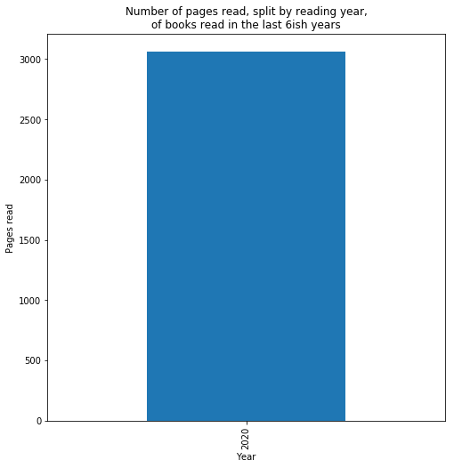

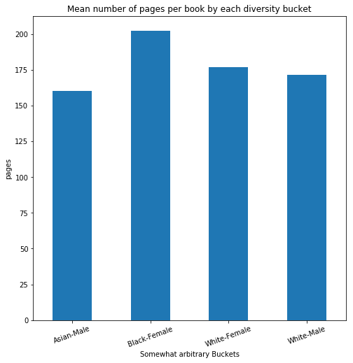

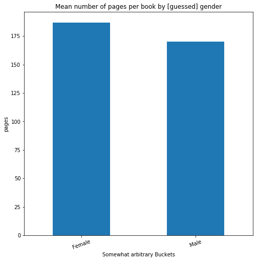
