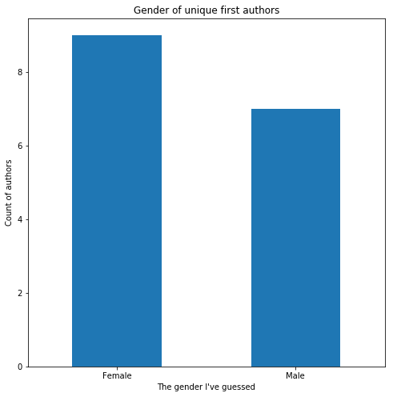

# Reading Analysis

I started this project at the end of 2019 to look at my own reading. I [wrote it up here](https://notionparallax.co.uk/2019/goodreads2019). [Clare Oh](https://github.com/Claire-Oh) picked it up in 2020 as part of her Python programming course. She extended it to examine the LGBTQI+ representation in her reading, in addition to the gender and ethnicity values that I looked at.

The repo is pretty dirty at the moment, but I'll clean it up soon. Get in touch if you want to do this for your own reading and I'll talk you through it.

