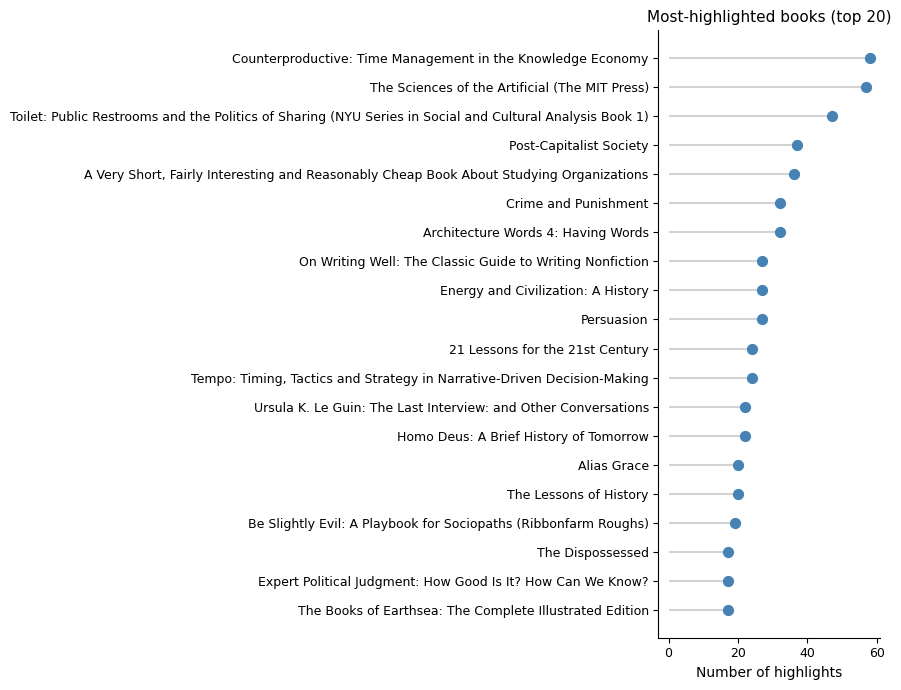
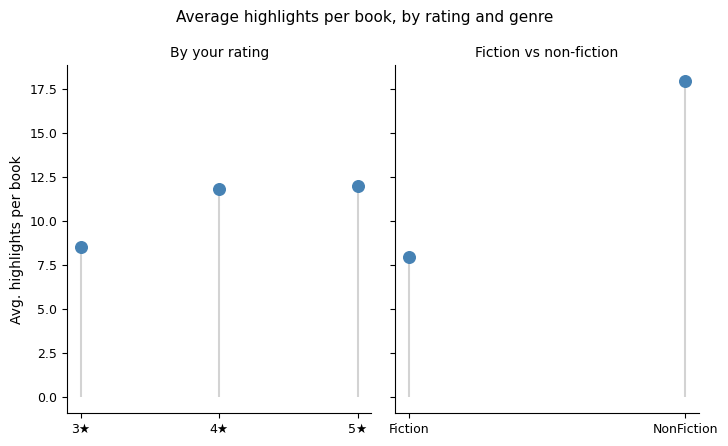
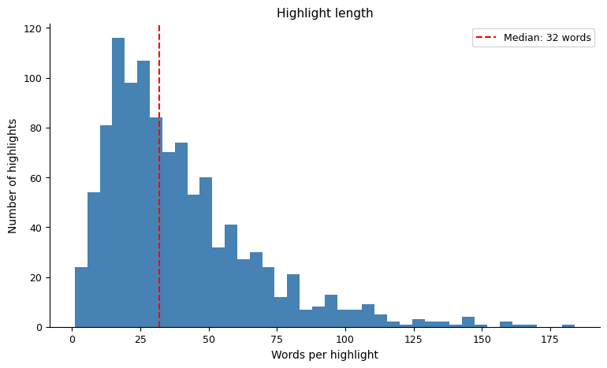
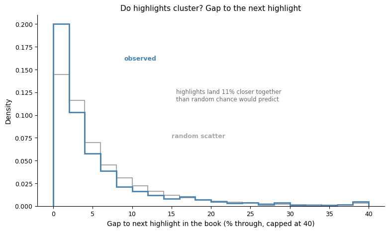
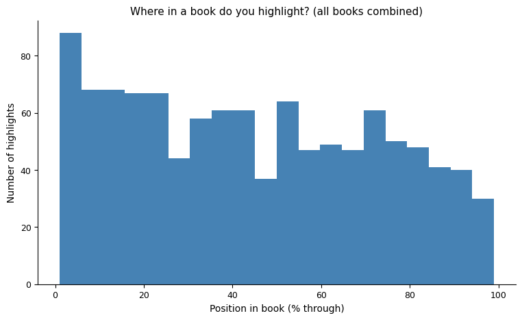
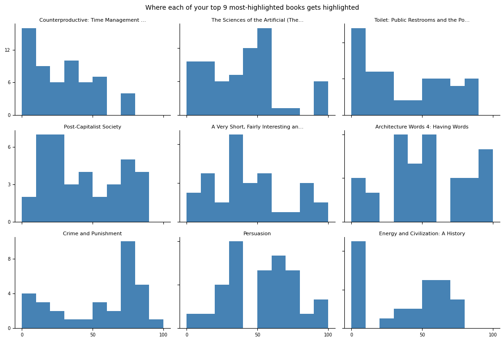

# What my Kindle highlights say about how I read

Buried in Goodreads' full data export is a file called `grass.json` — every Kindle highlight I've ever synced to my Goodreads profile: the quoted text, any note I attached to it, how far through the book it falls, and which book it's from. 1,096 highlights across 93 books, 26 of them with an actual note attached rather than just a bare quote.

It turned out to be a much richer dataset than I expected.

## The obvious stuff first

The books I've highlighted hardest are almost all dense non-fiction:

*Counterproductive: Time Management in the Knowledge Economy* leads with 58 highlights, followed by *The Sciences of the Artificial*, *Toilet: Public Restrooms and the Politics of Sharing*, and *Post-Capitalist Society*. That tracks: these are argument-dense books where nearly every paragraph has a quotable claim, versus a novel where the prose is doing something other than staking out a thesis.

That pattern holds up quantitatively. Joined against my book ratings and genre tags:

Non-fiction books get **18.0 highlights on average**; fiction gets **8.0** — more than double. Rating tells a similar but smaller story: 8.6 highlights/book at 3 stars, rising to 11.8 at 4 stars and 12.0 at 5 stars. Highlighting looks like a decent proxy for how much a book actually landed — though genre turns out to be the bigger driver of the two.

Highlights themselves are short — a median of 32 words, roughly one to two sentences:

## Do I highlight in bursts, or is it spread evenly through a book?

This is the question I actually got curious about. If you've just highlighted something, are you more likely to highlight something else *soon after* — or is each highlight an independent, one-off decision scattered randomly through the book?

To test it, I took every book with at least 5 highlights, looked at the gap (in % through the book) between each highlight and the next one in the same book, and compared that to a null model: the same number of highlights per book, scattered uniformly at random.

They cluster. The observed gap between consecutive highlights averages 5.07% of a book's length, versus 5.72% under random scatter — highlights land **11% closer together** than chance would predict, and the effect is far too large to be noise. This is exactly what you'd expect from how highlighting actually happens in practice: a single striking argument or well-turned paragraph tends to have several quotable lines back to back, or you go back and re-read a section and mark a handful of things in one pass. Highlighting isn't a uniform sampling process — it's bursty, tied to how interesting a specific passage is, not how interesting the book is on average.

## Why does the "where in the book" chart have two humps?

Looking at where highlights fall in a book overall (0% = start, 100% = end):

There's a clear front-loading — the first quarter of a book gets highlighted hardest — but also a second, smaller bump around the 50-75% mark, with a dip in between. My first instinct was to look for a universal reason: something about how nonfiction arguments are structured, or where an author places their best material.

That instinct turned out to be wrong. Breaking the same 9 books out individually tells a different story:

None of them, on their own, has that two-hump shape. *Counterproductive* is almost entirely front-loaded and essentially dead after 60%. *The Sciences of the Artificial* is nearly empty for the first 30%, peaks hard at 40-60%, then goes quiet before a small late bump. *Crime and Punishment* barely gets touched until it spikes around 70-80%. *Energy and Civilization* is almost all in the first 10%. Each book has its own idiosyncratic peak, in a different place, presumably wherever that particular book's densest or most quotable material happens to sit.

The aggregate "first and third quartile" shape isn't a real reading pattern — it's what you get from summing a handful of heavily-highlighted books with different individual shapes on top of each other. It's a composition effect, not a law of how people read. If there's a genuine general pattern here at all, it's just the front-loading: highlighting drops off toward the end of a book almost everywhere, probably because early chapters tend to carry more thesis statements, definitions, and framing claims — the stuff that's easiest to lift out as a standalone quote.

## The methodology note

One thing that didn't make it into any chart: `grass.json`'s `created_date` field looks like it should tell you *when* each highlight was made, but it doesn't — every highlight in a given book shares one identical timestamp (confirmed by checking: all 14 highlights in my *Dune* citations share the exact same second). That's a bulk-sync timestamp from whenever Goodreads pulled that book's notes from Amazon, not the moment you actually made the highlight. So the clustering result above is purely positional (where in the book), not temporal (how close together in time) — I don't have the data to say whether a highlighting session tends to produce a burst of highlights in one sitting, only that highlights bunch up by location within a book.
