# Reading Analysis

518 books. 12 years. Some observations.

---

## Cadence

The waterfall is the most honest chart here. Each line is a book — left edge when I started, right edge when I finished. The vertical spread is just the order I finished them in; there's no meaningful y-axis, which is why it has none.

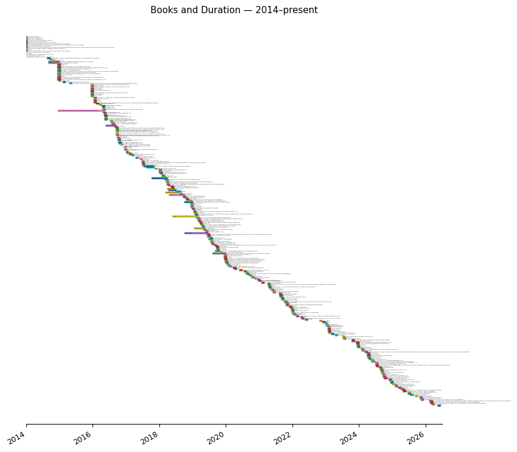

The annual and monthly views give the aggregate shape of the same information. Reading volume has been uneven — there are clearly years where life got in the way, and years where it didn't.

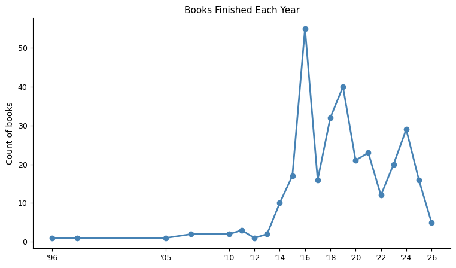

The monthly pattern is roughly what you'd expect. January and December are high — end-of-year accounting, possibly, or just more time at home. The middle of the year is flatter.

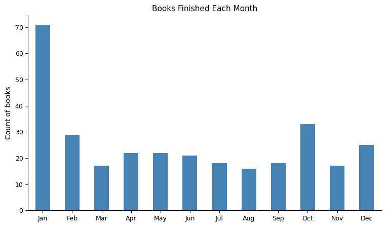

---

## What I Read

The three annotation columns — fiction vs. non-fiction, series vs. standalone, and LGBTQIA characters — alongside the two author demographic distributions, summarised together:

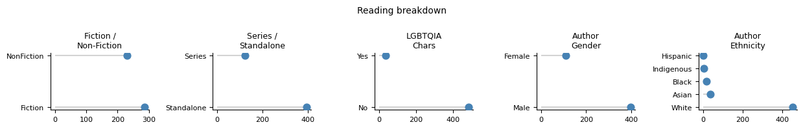

I read more fiction than non-fiction but the gap is smaller than I'd have guessed. The non-fiction skews toward architecture, design, cooking, and economics — genres I work in or cook in. The fiction skews toward speculative: Le Guin, Gibson, Jemisin, Stephenson. Series books are a minority; most of what I pick up is standalone.

The book format tells a story of its own. I've been on Goodreads since 2013 and on ebooks since roughly the same time.

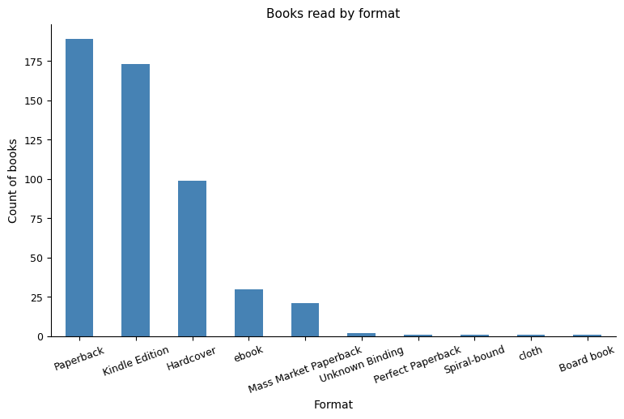

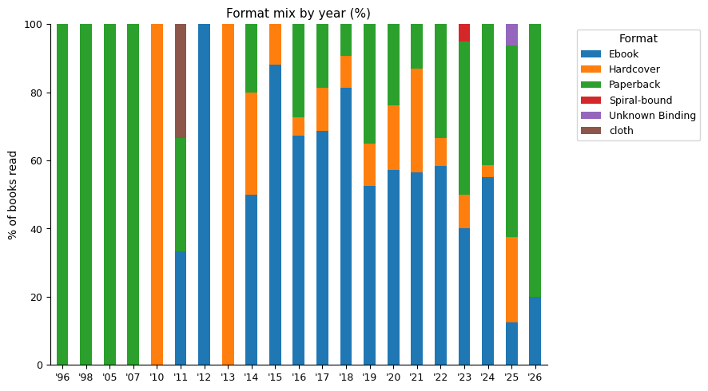

The trend toward ebooks, then the drift back — probably reflects phone-as-reading-device fatigue and the return of a comfortable reading chair. Or the Ondaatje phase in 2023, which was all paperbacks.

Page count is roughly normally distributed around 300 pages. The long tail to the right is Stephenson, Atwood, and Dostoevsky.

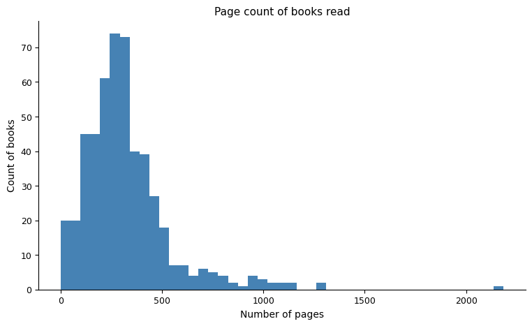

---

## The Books Themselves

Most of what I read is modern — but there's a meaningful tail going back centuries, with a few outliers at the ancient end (Caesar, Marcus Aurelius, Homer, Frontinus). The inset shows the post-1900 distribution in more detail, where most of the mass sits.

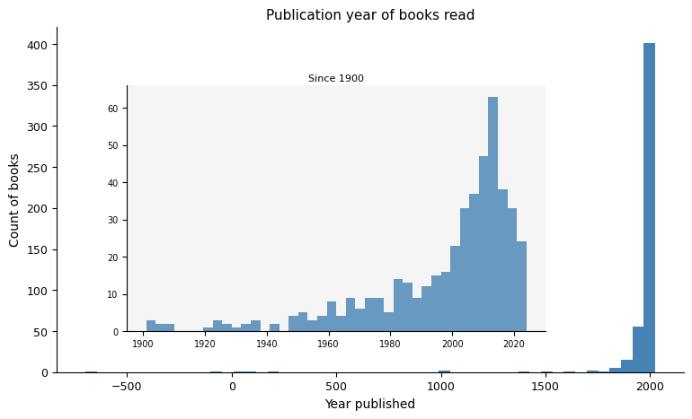

When books were published says less than you'd think. More interesting is the lag between publication and when I actually read them. The median book I read was published about 7 years before I read it — but that number varies a lot, from same-year releases to things I've been putting off for decades.

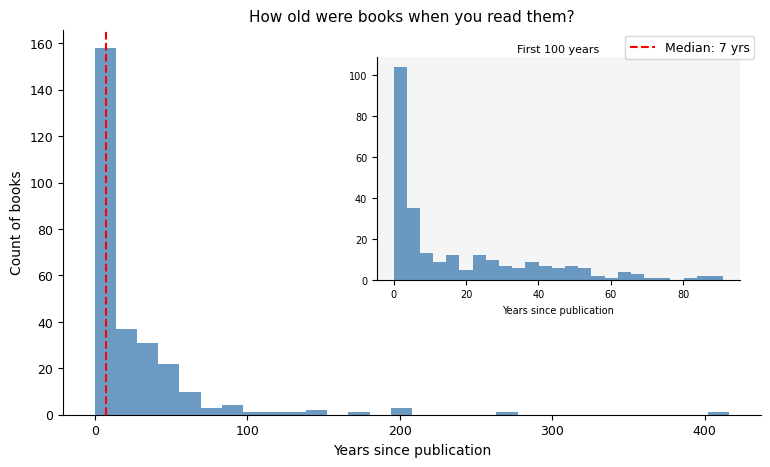

The trend in that lag is telling. In earlier years I was reading a lot of older material; more recently I'm closer to contemporary publication. Whether that's intentional or just what floats to the top of Goodreads is unclear.

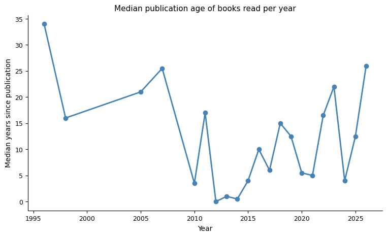

Pages read by publication year shows a different texture — the ancient books are few but some are long. The 20th century looms large. Stephenson alone accounts for a significant chunk.

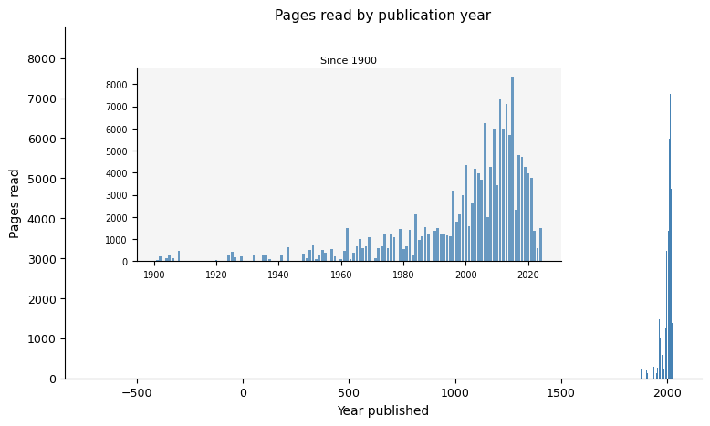

The publishers chart is dominated by Penguin (and its imprints — Vintage, Ace, Cornerstone — merged into one) because that's how the English-language paperback market works.

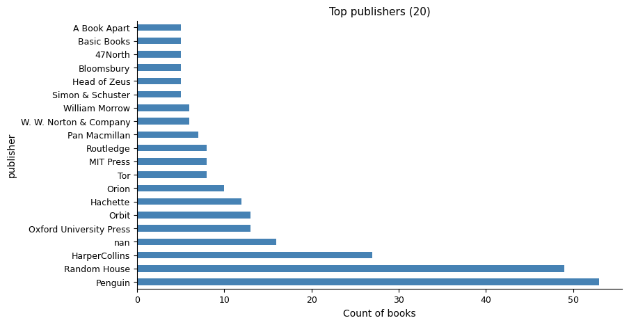

---

## How I Felt About It

My ratings cluster high — mostly 4s and 5s. I'm either an optimistic reader, I'm good at abandoning books before I finish them, or I underuse the lower end of the scale. Probably all three.

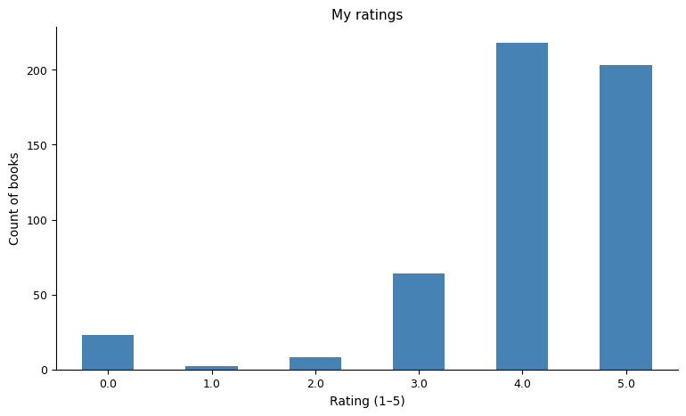

There's some variation in average rating by year, but no strong trend. If anything, the years where I read the most broadly also show slightly higher average ratings — which could be selection bias in the other direction.

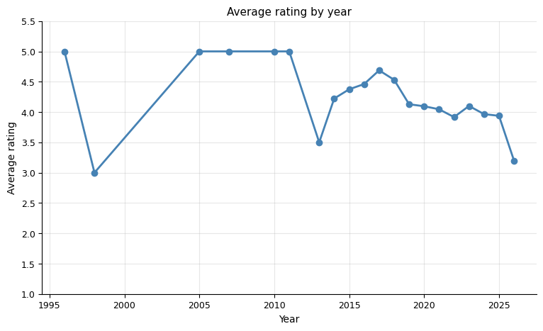

Does the demographic of the author affect how I rate their books? The lollipop chart holds the answer, or fails to. The differences are small enough that I wouldn't read much into them.

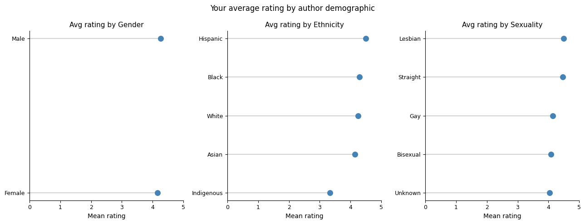

---

## Who Wrote What I Read

The bubble chart gives the clearest view of the gender-by-ethnicity breakdown of the authors I've read. The numbers inside each bubble are book counts.

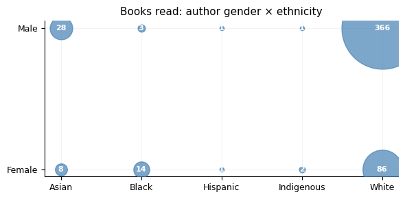

White male authors dominate, which is the structural baseline of English-language publishing — but not a reason to stop there. The diversity trends chart (% of books in a year by female, non-white, and LGBTQIA+ authors) shows how that has shifted over the 12 years.

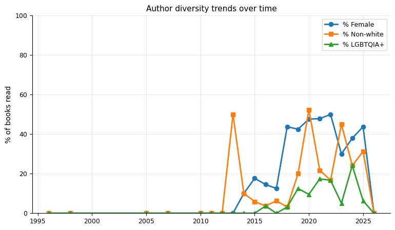

The same data broken into small multiples — one panel per demographic compound, plus a diversity index in the final coral panel. The index is normalised Shannon entropy: 0 means all books that year by one demographic group, 1 means evenly spread across all groups. The trend, such as it is, is upward.

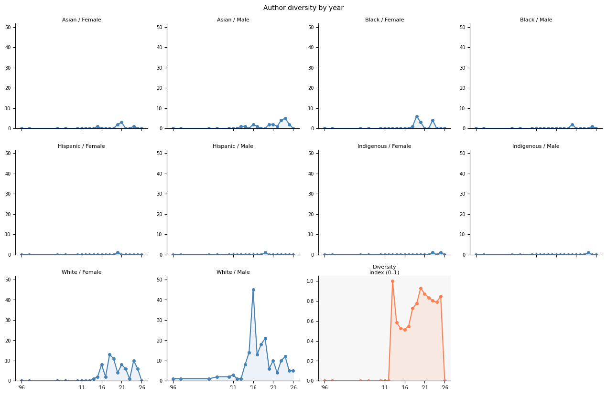

Looking at fiction versus non-fiction split by year:

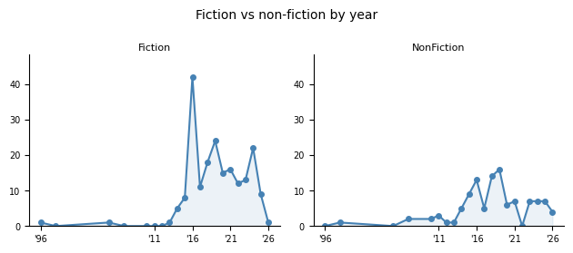

And the gender-by-life-status of authors each year (living vs. dead is a useful lens on whether I'm reading contemporary work):

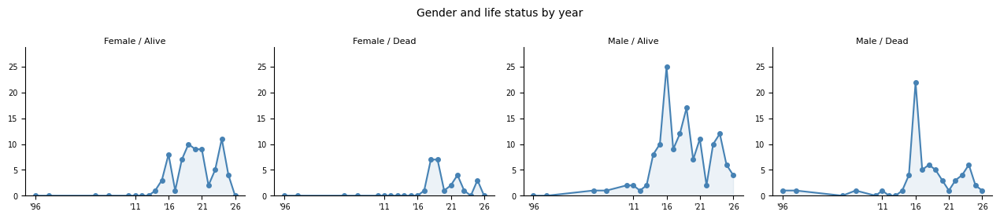

The nationality distribution confirms the Anglosphere dominance of my reading, with Australian authors doing proportionally well for the size of the market.

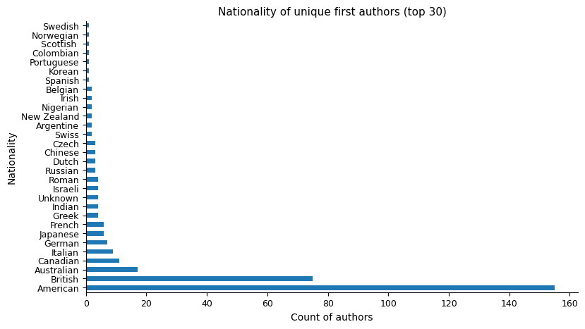

Fiction and non-fiction draw from different demographic pools. The cross-tab between compound diversity and genre shows this clearly — non-fiction leans even more toward white male authors than fiction does.

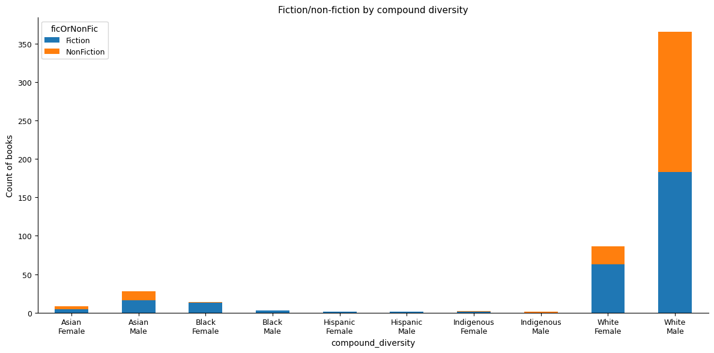

---

## Depth and Volume

Three books read twice: *The English Patient*, *The Odyssey*, and *Dispatches from Anarres*. Everything else, once.

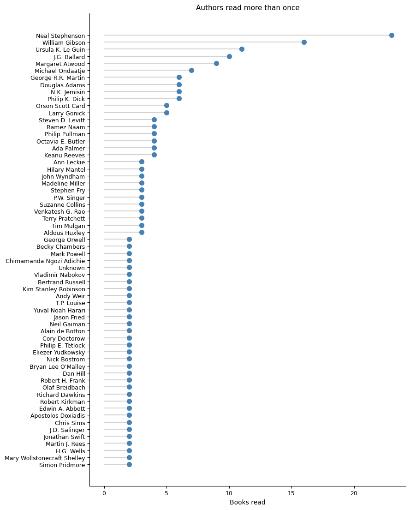

Neal Stephenson at the top by a wide margin — mostly the Baroque Cycle and the Mongoliad series plus a decade of standalone novels. Ursula K. Le Guin second, across the Hainish Cycle and Earthsea. Atwood third (the MaddAddam trilogy, the Cromwell series, and miscellany).

Pages per year tracks reading volume differently from book count — a year of long books looks like a high-output year even if the book count is modest.

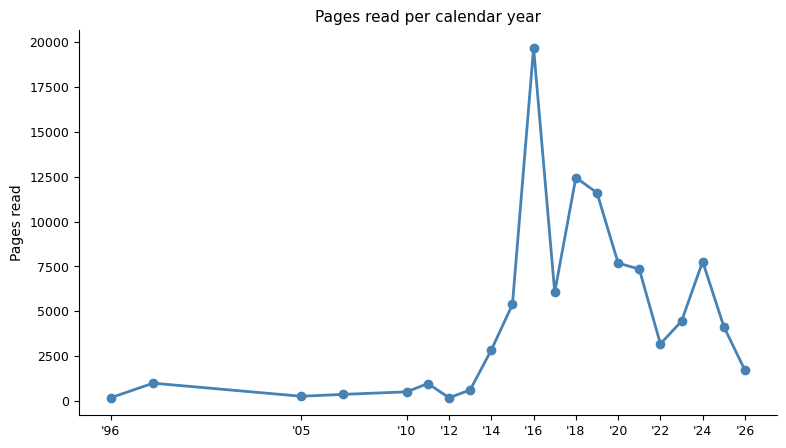

Pages by format: ebooks account for the majority of pages read, but the distribution within format types is uneven. Mass market paperbacks tend to be shorter; hardcovers tend to be the books I sit with longest.

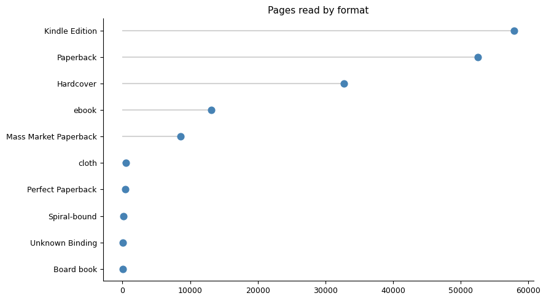

---

*Generated with `python analysis.py` from `goodreads_library_export.csv`. Data current as of July 2026.*
