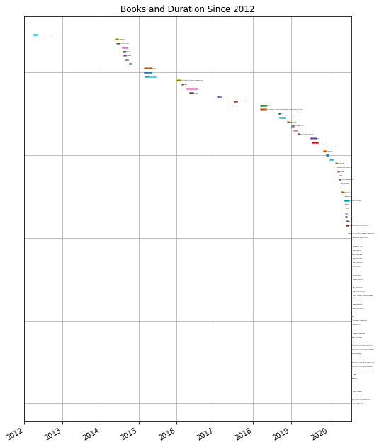
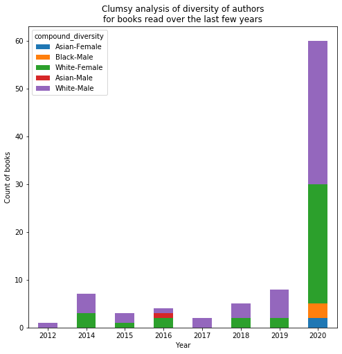
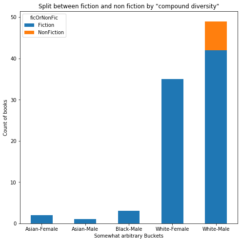
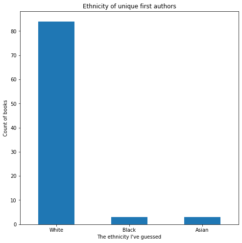
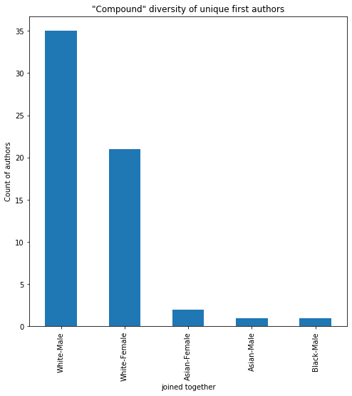
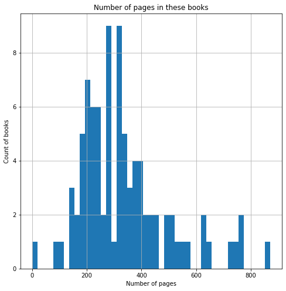
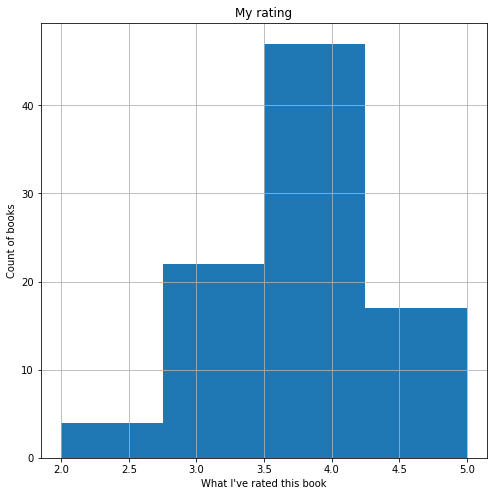

# Books

[Goodreads released my 2019 reading stats](https://www.goodreads.com/user/year_in_books/2019/19575421) this week, which nudged me into finishing a project that's been on my mind for a while now.

I've made the graphs here using the data I record in Goodreads. That gets updated when I start a new book on my Kindle, or if I put it in manually when I read a paper book.

There seems to be an odd, and annoying, thing where Goodreads have two APIs. One of which is quite good, and is used to generate their website. The other is total garbage and is exposed to the public. This is surprising, given that Goodreads belongs to Amazon, and therefore has access to all their book data, and people who know about AWS and how to make things like Goodreads work well. Anyway, this results in only about half the data being available through the API. Once I'd done that first pass, I put everything into a spreadsheet and then went to the Goodreads website to get the rest of the data. Clickety click.

There are still issues, like the big flat spot in the waterfall graph at the end of 2017. Those books shouldn't be there, but I haven't got onto finding where they _should_ be. Another day.

The thing that spurred me into looking at this was to quantify the diversity of the books that I'm reading. I've always had a vague idea in by head that I would try to read a fiction book, then a non fiction.

Turns out that the ratio usually sits a bit more like 2/3 fiction.

| year | fraction that's non-fic |
|-----------------|--------|
| 2013   | 1/2 |
| 2014   | 3/7 |
| 2015   | 1/2 |
| 2016   | 1/9 |
| 2017   | 1/3 |
| 2018   | 2/5 |
| 2019   | 1/3 |

Given that I fail at keeping my fiction habit under control. How am I doing with reading authors who are different to me?

(Secret: I think fiction is super enjoyable and useful, and if you're one of these people who don't read fiction, then you're really missing out!)

Turns out that even with a concerted effort over the last couple of years, still pretty bad!

This is going to need a bit of unpacking: 
* Goodreads only reports the first listed author, so a book like [Toilet](https://www.goodreads.com/review/show/2873707825) has two listed authors, a man and a woman, but the first listed is a man so it comes up a man in this graph.
* I've had to guess the gender of the authors from their pictures or Wikipedia pages. I did this pretty fast and didn't go into any real depth with it. If I've misgendered anyone then can someone let me know so I can fix it. The code doesn't assume a gender binary, so it can take extra data.
* Much the same applies to ethnicity. It's a very clumsy classification that I got from from: [Racial and Ethnic Categories and Definitions for NIH Diversity Programs and for Other Reporting Purposes](https://grants.nih.gov/grants/guide/notice-files/not-od-15-089.html) and they use the following classifications.

    > American Indian or Alaska Native. A person having origins in any of the original peoples of North and South America (including Central America), and who maintains tribal affiliation or community attachment.
    > 
    > Asian. A person having origins in any of the original peoples of the Far East, Southeast Asia, or the Indian subcontinent including, for example, Cambodia, China, India, Japan, Korea, Malaysia, Pakistan, the Philippine Islands, Thailand, and Vietnam.
    > 
    > Black or African American. A person having origins in any of the black racial groups of Africa. Terms such as "Haitian" or "Negro" can be used in addition to "Black or African American."
    > 
    > Hispanic or Latino. A person of Cuban, Mexican, Puerto Rican, South or Central American, or other Spanish culture or origin, regardless of race. The term, "Spanish origin," can be used in addition to "Hispanic or Latino."
    > 
    > Native Hawaiian or Other Pacific Islander. A person having origins in any of the original peoples of Hawaii, Guam, Samoa, or other Pacific Islands.
    > 
    > White. A person having origins in any of the original peoples of Europe, the Middle East, or North Africa.

    I'd like to add a bit more nuance to this in the future. Again, I've guessed these clasifications, so if you spot any correction, tell me.

It turns out that I read very little non-fiction written by women. I'd like to see what the baseline is here; what proportion of non-fiction books do women write? What proportion of books about topics that I'm interested in do women write?

Some blunter stats about this:

---

What about the books themselves?

Median pages: 307, mean pages: 329

This makes sense, the number of 1000 page Neal Stevenson epics is offset by some 30 page comic books.

I stole an idea from someone a while ago, that books are mostly a long term medium, so if a book is good now, it'll be good in 5 years time, but if a book is crap now, it will have disappeared in 5 years time. Therefore, it makes sense to wait a bit. From this graphs, it looks like I'm terrible at taking that advice too.

Median year: 2012, mean year: 2004

That might not be strictly true. I read the Odyssey this year, and that's listed as 2019 because it's a new translation.

All my repeat authors over 2 are fiction. You can also see that a lot of my diversity comes from pounding fiction series.

But did I like it? I love reading, and people say that I'm a soft rater, giving almost everything a 4 or a 5, but I have a lot of people who recommend books to me, and I abandon books that are turning out to be a 1 or a 2.

The waterfall is impossible to read as a png, so [here's a pdf](out/bookWaterfall.pdf).

